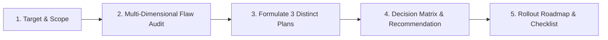

# Design Analysis & 3-Plan Formulation Skill

This skill equips the agent to perform an exhaustive, multi-dimensional design critique of any intended UI target—whether an individual component, a composite view, a full screen/page, a user interaction flow, or a domain object representation—diagnose critical flaws and gaps, and formulate **three genuinely distinct, actionable architectural/design plans**.

---

## When to Use This Skill

Activate this skill when:
- The user asks to "review", "critique", "analyze", or "audit" a design, component, page, or UI spec.
- The user presents a UI mockup, wireframe, or existing component code and wants to know what's wrong with it.
- The user asks for design options, alternative plans, or a redesign proposal.
- You need to evaluate an interface before proposing or implementing major UI refactoring.

---

## Core 5-Step Diagnostic & Planning Procedure

Follow these five steps systematically whenever executing this skill:

---

### Step 1: Target Identification & Context Scoping

First, identify what category the target belongs to and establish design parameters:

1. **Classify Target Type**:
   - **Component**: An isolated widget (e.g. `<Button>`, `<Dropdown>`, `<AppointmentCard>`, `<DataGridRow>`).
   - **View / Section**: A composite panel or layout zone (e.g. `<FilterBar>`, `<PatientTimeline>`, `<BillingSummary>`).
   - **Page / Screen**: A complete route or screen (e.g. `/dashboard`, `/appointments/[id]`, `/settings`).
   - **Object / Entity**: The presentation model for a domain entity (e.g. Patient Record, Dental Chart, Invoice).
   - **Flow / Interaction**: A multi-step journey (e.g. Booking Wizard, Checkout, Onboarding).
2. **Determine Tech & Design Constraints**:
   - Framework & styling system (e.g. Next.js, React, Tailwind, Material-UI, Flutter).
   - Target devices (Mobile-first, Desktop, Responsive, Touch vs Pointer).
   - Design tokens (Color palettes, spacing scale, typographic hierarchy).

---

### Step 2: Multi-Dimensional Flaw Audit

Audit the target against all 5 dimensions defined in the [Diagnostic Rubric](./references/rubric.md):

1. **UX & Usability (Cognitive Ergonomics)**:
   - Does it violate mental models? Is cognitive load minimized (Hick's & Miller's laws)?
   - Are primary actions clear and reachable (Fitts's law)? Is system status transparent?
2. **Visual Design & Hierarchy**:
   - Is there a clear typographic scale? Are margins and paddings on a consistent 4px/8px grid?
   - Is visual weight balanced? Are semantic colors used consistently?
3. **Accessibility (WCAG 2.2 Level AA Compliance)**:
   - Do contrast ratios meet $\ge 4.5:1$ for normal text and $\ge 3.0:1$ for UI controls?
   - Are touch/click targets $\ge 44 \times 44\text{ pt}$ / $48 \times 48\text{ dp}$?
   - Is every interactive element keyboard-operable with a visible `:focus-visible` ring and screen-reader label?
4. **Architecture, State & Code Ergonomics**:
   - Is it a "god component" violating Single Responsibility?
   - Is there excessive prop drilling? Are re-renders localized? Is business logic separated from presentation?
5. **Edge Cases & Resilience**:
   - How does it handle zero items (empty state), 10,000 items, and unhandled `undefined` props?
   - What happens with long localized text strings? Are loading skeletons and error states handled?

> Assign every detected flaw a severity level: **🔴 CRITICAL (P0)**, **🟠 HIGH (P1)**, **🟡 MEDIUM (P2)**, or **🟢 LOW (P3)**.

---

### Step 3: Formulate Three Distinct Design Plans

Do NOT propose minor cosmetic variations. Generate three divergent plans following the [Three Plan Archetypes](./references/three_plan_archetypes.md):

#### 🛡️ Plan A: Surgical Refinement (Low Risk / Immediate Velocity)
- **Philosophy**: Fix critical P0/P1 flaws with minimal code changes. Zero breaking API changes; zero regression risk.
- **Focus**: Accessibility contrast/labels, critical edge-case crash guards, minor spacing/alignment patches.
- **Delivery**: Hours to 1 day.

#### ⚖️ Plan B: Balanced Best-Practice Overhaul (Production Gold Standard)
- **Philosophy**: Modernize the target to production excellence and design system alignment.
- **Focus**: Compound component refactoring, custom hook state extraction, fluid responsive layouts, animated skeleton states, full WCAG 2.2 AA compliance.
- **Delivery**: 2 to 4 days.

#### 🚀 Plan C: Radical Reimagination (First-Principles Innovation)
- **Philosophy**: Rethink the problem space from the ground up without legacy baggage.
- **Focus**: Novel interaction models (command palettes, contextual slide-overs, AI-assisted defaults), optimistic UI with undo mechanics, headless decoupled architecture.
- **Delivery**: 1 to 2 sprints.

---

### Step 4: Comparative Decision Matrix & Opinionated Recommendation

Evaluate all three plans side-by-side using a structured matrix:
- **Flaw Resolution** (Does it fix P0, P1, P2, P3?)
- **UX Impact & Polish** (User satisfaction and visual delight)
- **Architectural Health** (Decoupling and testability)
- **Implementation Effort** (Hours vs Days vs Sprints)
- **Risk Level** (Breaking changes, regression potential)

**Provide an unambiguous recommendation**: State which plan the team should execute based on current project maturity, deadlines, and technical debt goals.

---

### Step 5: Execution Roadmap & Verification Checklist

Provide a concrete rollout roadmap and a verification checklist:
- [ ] **Visual Verification**: Tested across standard viewports (375px mobile, 768px tablet, 1440px desktop).
- [ ] **Accessibility Verification**: Automated Lighthouse/axe audit passing 100%; keyboard-only tab cycle test; screen reader announcements verified.
- [ ] **State & Resilience**: Empty state, loading skeleton, error retry, and extreme text length tested.
- [ ] **Unit / Integration Tests**: Component tests verify user interaction handlers and state transitions.

---

## Output Standard & Reference Resources

- **Report Template**: Always format the output following the [Design Analysis Report Template](./templates/design_analysis_report_template.md).
- **Evaluation Rubric**: Refer to the comprehensive checklist in [Diagnostic Rubric](./references/rubric.md).
- **Plan Taxonomy**: Deep-dive into archetypes in [Three Plan Archetypes](./references/three_plan_archetypes.md).
- **End-to-End Example**: Review a complete real-world critique in [Component Critique Example](./examples/component_critique_example.md).
