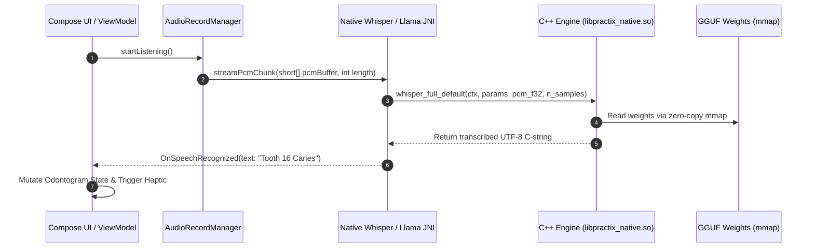
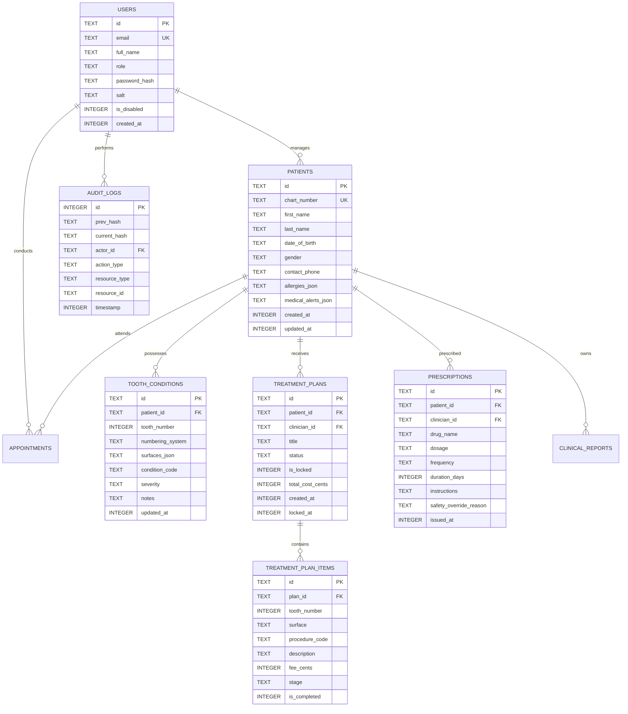

# SUITE 1: PRODUCT & ARCHITECTURE (PRE-BUILD)
**Application:** Practix  
**Sole Proprietor & Principal Developer:** Devanapally Charan Tej  
**Document Version:** 1.0.0-PROD  
**Target Environments:** Android (API 24–36, Tablet/Handset) & Complementary Web Portal  

---

## 1. Product Requirements Document (PRD) & MVP Scope

### 1.1 Executive Summary & Problem Statement
Dental clinicians spend upwards of 25–35% of their daily chairside time manually inputting periodontal charting metrics, clinical notes, and treatment plans into legacy electronic dental record (EDR) software. This creates three critical friction points:
1. **Infection Control & Cross-Contamination:** Switching between physical dental instruments and computer keyboards/mice breaks sterile chairside protocols.
2. **Clinical Note Latency & Burnout:** Clinicians postpone charting until the end of clinic hours, causing recall errors, documentation backlogs, and clinician fatigue.
3. **Data Privacy & Connectivity Fragility:** Cloud-only practice management systems risk latency spikes, offline service interruptions, and non-compliance with strict healthcare privacy mandates (HIPAA, GDPR, DPDP Act) when processing sensitive Protected Health Information (PHI).

**Practix** (engineered by Devanapally Charan Tej) solves this by delivering an **offline-first, voice-native, cryptographic clinical workspace** powered by on-device automatic speech recognition (`whisper.cpp`), local Clinical Decision Support (`llama.cpp` GGUF execution), interactive 3D anatomical odontogram visualizers (Google Filament), and hardware-backed SQLCipher encryption.

---

### 1.2 Target Personas

```
+--------------------------+-------------------------------------------------------+--------------------------------------------------+
| Persona                  | Role & Environment                                    | Core Pain Point & Objective                      |
+--------------------------+-------------------------------------------------------+--------------------------------------------------+
| Dr. Ingrid Halvorsen     | Principal Dental Surgeon & Practice Administrator     | Needs immutable audit logging, practice oversight,|
|                          | (Private multi-chair clinic)                          | team invitation control, and strict compliance.  |
+--------------------------+-------------------------------------------------------+--------------------------------------------------+
| Dr. Tomas Ferreira       | Associate Dentist / Periodontist                      | Requires fast, hands-free voice charting while   |
|                          | (High-throughput operatory)                           | wearing gloves; instant drug interaction checks. |
+--------------------------+-------------------------------------------------------+--------------------------------------------------+
| Sarah Jenkins, RDH       | Registered Dental Hygienist / Clinical Assistant      | Needs rapid pocket depth logging, bleeding index  |
|                          | (Hygiene & prophylactic operatory)                    | recording, and automated patient summary export. |
+--------------------------+-------------------------------------------------------+--------------------------------------------------+
```

---

### 1.3 Key Functional Requirements (FR)

- **FR-1: Hands-Free Voice Charting & Dictation Engine**
  - **FR-1.1:** Continuous audio streaming via `AudioRecordManager` into native `whisper.cpp` inference engine.
  - **FR-1.2:** Deterministic regex and semantic parser (`VoiceCommandParser`) supporting standard dental vernacular (e.g., *"Tooth 16 MO composite restoration"*, *"Pocket depth 4 3 4 bleeding on probing"*).
  - **FR-1.3:** Real-time visual dictation feedback bar with continuous speech-to-intent preview and single-action voice undo command (*"Undo last entry"*).
  - **FR-1.4:** Support for dual numbering systems: FDI World Dental Federation (e.g., Tooth 11–48) and Universal Numbering System (Tooth 1–32).

- **FR-2: On-Device Clinical Decision Support (CDS) & Multi-Agent Copilot**
  - **FR-2.1:** Local GGUF LLM inference (Llama-3.2-1B/3B, Gemma-2-2B) running over on-device RAM allocation boundaries.
  - **FR-2.2:** Dynamic device memory tier classification (`ActivityManager.MemoryInfo`) to prevent OOM termination:
    - Tier A ( $\ge 6\text{ GB}$ Total / $\ge 2.5\text{ GB}$ Free): Llama-3.2-3B-Instruct (Q4_0).
    - Tier B ( $\ge 4\text{ GB}$ Total / $\ge 1.6\text{ GB}$ Free): Gemma-2-2B-IT (Q4_0).
    - Tier C ($< 4\text{ GB}$ Total): Llama-3.2-1B-Instruct (Q4_0).
  - **FR-2.3:** Clinical Safety Sentinel evaluating drug-drug and drug-condition contraindications:
    - Recorded patient allergies (e.g., Penicillin, Latex, Amoxicillin).
    - Anticoagulant therapy $\leftrightarrow$ NSAID cross-risks (bleeding risk).
    - Bisphosphonate therapy $\leftrightarrow$ Invasive surgical extractions (Medication-Related Osteonecrosis of the Jaw - MRONJ).
  - **FR-2.4:** Optional cloud multimodal synthesis (Google Gemini 1.5/2.0 API) for complex radiographic DICOM/JPEG interpretation with local PHI de-identification before transmission.

- **FR-3: Interactive 3D Anatomical Odontogram Visualizer**
  - **FR-3.1:** 3D OpenGL ES / Google Filament surface mesh renderer (`mandibular-first-molar.obj`, full maxillary & mandibular arches).
  - **FR-3.2:** Color-coded clinical condition mapping:
    - Red: Active Caries / Decay.
    - Blue: Existing Sound Restoration (Amalgam, Composite, Ceramic).
    - Amber: Defective Margin / Recurrent Caries.
    - Purple: Endodontic Obturation / Post & Core.
    - Grey Hatch: Extracted / Missing.
  - **FR-3.3:** Interactive multi-surface selection (Mesial, Occlusal, Distal, Buccal/Facial, Lingual/Palatal).

- **FR-4: Practice Workflow, Scheduling & Immutable Records**
  - **FR-4.1:** Today Queue dashboard displaying day-grid schedule, check-in status, and encounter timers.
  - **FR-4.2:** Treatment Plan Synthesizer with phase grouping (Immediate/Emergency, Phase 1 Disease Control, Phase 2 Restorative, Phase 3 Maintenance).
  - **FR-4.3:** Immutable Record Locking: Once a clinician signs/publishes a treatment plan or note, the record locks permanently; amendments require signed, dated addenda.
  - **FR-4.4:** Patient Chart PDF Generator with cryptographically verifiable checksums.

- **FR-5: Cryptographic Security, Audit & Authentication**
  - **FR-5.1:** Local database encryption via SQLCipher using AES-256 in CBC mode, with keys stored in Android Hardware-Backed Keystore.
  - **FR-5.2:** Biometric Lock (BiometricPrompt Class 3 / Strong) with configurable idle auto-lock (default: 15 minutes idle, 8 hours absolute limit).
  - **FR-5.3:** Tamper-evident append-only audit trail: Each log entry stores `SHA-256(prev_hash + timestamp + actor_id + action_type + resource_id)` with database triggers enforcing zero `UPDATE` or `DELETE` operations.

---

### 1.4 Non-Functional Requirements (NFR)

```
+-----------------------+---------------------------------------------------------------------------------------------+
| Category              | Metric / Requirement Specification                                                          |
+-----------------------+---------------------------------------------------------------------------------------------+
| Speech Latency        | End-of-utterance to UI state mutation <= 450 ms on arm64-v8a devices using quantized Whisper.|
| LLM Response Latency  | First token time-to-generation (TTFT) <= 800 ms; output throughput >= 14 tokens/sec.        |
| 3D Viewport FPS       | Constant 60 FPS under Google Filament viewport during rotation, zoom, and surface tagging. |
| Security / Crypto     | Zero unencrypted plaintext written to disk; cache dirs flushed on session termination.      |
| Cold Launch Time      | Cold startup to Today Queue <= 1.8 seconds on mid-range Android devices.                    |
| Memory Ceiling        | Peak heap allocation <= 480 MB (excluding native mmap for GGUF model weights).              |
+-----------------------+---------------------------------------------------------------------------------------------+
```

---

### 1.5 MVP Scope Matrix

```mermaid
quadrantChart
    title Feature Priority & MVP Boundary
    x-axis Low Technical Complexity --> High Technical Complexity
    y-axis Low Clinical Impact --> High Clinical Impact
    quadrant-1 Post-MVP High Value
    quadrant-2 In-Scope MVP (Core)
    quadrant-3 Out of Scope
    quadrant-4 Low Priority / Fast Follows
    "SQLCipher AES-256 Encryption": [0.35, 0.95]
    "2D/3D Odontogram Charting": [0.45, 0.92]
    "Whisper Voice Dictation": [0.48, 0.90]
    "Prescription Safety Checks": [0.25, 0.88]
    "Immutable Audit Log Chain": [0.30, 0.85]
    "Patient Roster & PDF Export": [0.20, 0.78]
    "Local GGUF CDS Reasoning": [0.82, 0.86]
    "Gemini Multimodal Radiograph Analysis": [0.88, 0.75]
    "Automated Insurance Clearinghouse Sync": [0.92, 0.40]
    "Patient-facing Mobile Portal": [0.70, 0.25]
    "SMS Appointment Marketing Engine": [0.30, 0.20]
    "Custom Tooth Surface 3D Shader Editor": [0.85, 0.30]
```

---

## 2. User Stories & Acceptance Criteria

### Story 1: Hands-Free Voice Odontogram Charting
**As a** Chairside Dental Surgeon  
**I want to** dictate tooth status, pocket depths, and restorations hands-free while wearing examination gloves  
**So that** I maintain a sterile operatory field and eliminate post-procedure charting overhead.

```gherkin
Feature: Voice-Assisted Odontogram Entry

  Scenario: Successfully chart a compound composite restoration via voice command
    Given the clinician is viewing the active chart of patient "Eleanor Vance"
    And the hands-free voice dictation service is listening
    When the clinician utters "Tooth one six occlusal composite restoration required"
    Then the local Whisper engine transcribes the audio buffer within 400 milliseconds
    And the VoiceCommandParser identifies Tooth 16, Surface "O", Status "Planned", Type "Composite"
    And Tooth 16 on the 3D odontogram highlights the occlusal facet in amber
    And a confirmation chip displays "Tooth 16: O - Composite (Planned)" in the active draft log

  Scenario: Voice dictation error correction via voice undo
    Given a voice charting entry was just applied to Tooth 24
    When the clinician utters "Cancel that" or "Undo last entry"
    Then the system rolls back the database state for Tooth 24 to its immediate prior revision
    And an auditory haptic tone confirms the reversion
```

---

### Story 2: Clinical Decision Support & Safety Sentinel Check
**As an** Attending Clinician  
**I want to** be automatically alerted if I prescribe a medication contraindicated by patient history  
**So that** I prevent adverse drug reactions and medical errors.

```gherkin
Feature: Prescribing Safety Sentinel

  Scenario: Prescribe NSAID to a patient on Anticoagulant Therapy
    Given patient "Arthur Pendelton" has an active medical record condition "Warfarin Therapy"
    When the clinician attempts to issue a prescription for "Ibuprofen 600mg TID"
    Then the RedFlagSafetyChecker interrupts the workflow with a modal alert
    And the alert specifies "CRITICAL INTERACTION: Anticoagulant (Warfarin) + NSAID (Ibuprofen) increases gastrointestinal bleeding risk"
    And the "Sign & Issue" button is disabled until the clinician either selects an alternative (e.g., Acetaminophen) or enters an explicit clinical override rationale

  Scenario: Prescribe Amoxicillin to a penicillin-allergic patient
    Given patient "Clara Oswald" has a recorded allergy "Penicillin - Anaphylaxis"
    When the clinician prescribes "Amoxicillin 500mg"
    Then the system triggers an immediate Level-1 Safety Lock
    And the on-device CDS suggests non-beta-lactam alternatives such as "Clindamycin 300mg" or "Azithromycin 500mg"
```

---

### Story 3: Biometric Lockout & Tamper-Evident Session Expiry
**As a** Dental Practice Compliance Officer  
**I want** unattended clinical tablets to lock immediately and maintain a tamper-evident record of access  
**So that** unauthorized individuals cannot inspect patient charts.

```gherkin
Feature: Clinical Security and Idle Revocation

  Scenario: Automatic session idle timeout
    Given a clinician is logged into the workspace and viewing a patient chart
    When no touchscreen, voice, or sensor interaction occurs for 15 consecutive minutes
    Then the app transitions to the BiometricLockOverlay state
    And all cached chart data in memory is cleared from the top Compose composition
    And restoring the chart requires Class-3 Biometric verification (Fingerprint or Face)

  Scenario: Cryptographic audit log chaining
    When the clinician accesses the patient chart for "Marcus Brody"
    Then an audit record is created containing the timestamp, clinician_id, action "CHART_VIEW", and target patient_id
    And the record calculates its hash using SHA-256 over (previous_record_hash + record_payload)
    And the record is inserted into the append-only SQLite table where UPDATE and DELETE triggers are blocked
```

---

## 3. System Architecture Summary & Tech Stack Justification

### 3.1 Layered Architecture Overview

```
+-----------------------------------------------------------------------------------+
|                            PRESENTATION LAYER (UI)                                |
|  Jetpack Compose | Material 3 | Navigation 3 | Filament 3D SurfaceView | Compose BOM |
+-----------------------------------------------------------------------------------+
                                         │
                                         ▼
+-----------------------------------------------------------------------------------+
|                             DOMAIN & STATE LAYER                                  |
|  VoiceChartingViewModel | PatientDetailViewModel | ScheduleViewModel | StateFlow   |
+-----------------------------------------------------------------------------------+
             │                                              │
             ▼                                              ▼
+------------------------------------+   +------------------------------------------+
|      ON-DEVICE AI & SPEECH LAYER   |   |        DATA & PERSISTENCE LAYER          |
|  - whisper.cpp (C++ / CMake / NDK) |   |  - SQLCipher (AES-256 SQLite Engine)     |
|  - llama.cpp / OnDeviceLlmEngine   |   |  - Android Keystore (Master Key Provider)|
|  - ClinicalCorpusRepository (RAG)  |   |  - NetworkClient (Encrypted Cloud Sync)  |
|  - Gemini Multimodal Fallback SDK  |   |  - Append-Only Tamper-Evident Hash Chain |
+------------------------------------+   +------------------------------------------+
                                         │
                                         ▼
+-----------------------------------------------------------------------------------+
|                              HARDWARE / OS CORE                                   |
|   Android 7.0 - 16 (API 24-36) | arm64-v8a NDK | Secure Element / StrongBox       |
+-----------------------------------------------------------------------------------+
```

---

### 3.2 Tech Stack Justification Matrix

```
+----------------------+-----------------------------+------------------------------------------------------------------------+
| Subsystem            | Selected Technology         | Justification & Clinical Trade-Off Analysis                            |
+----------------------+-----------------------------+------------------------------------------------------------------------+
| UI Framework         | Android Jetpack Compose M3  | Declarative UI enables responsive multi-pane tablet layouts, strict    |
|                      |                             | unidirectional data flow (UDF), and zero view-hierarchy inflation lag. |
+----------------------+-----------------------------+------------------------------------------------------------------------+
| 3D Graphics Engine   | Google Filament             | Lightweight PBR (Physically Based Rendering) engine built by Google    |
|                      | (filament-android, gltfio)  | for mobile; outperforms heavy game engines (Unity/Unreal) in memory    |
|                      |                             | footprint and startup latency while rendering realistic tooth enamel.  |
+----------------------+-----------------------------+------------------------------------------------------------------------+
| Speech Recognition   | whisper.cpp (Native C++)    | Highly optimized AVX/NEON SIMD execution of OpenAI Whisper on CPU/GPU. |
|                      |                             | Zero network dependence; 100% chairside patient audio privacy.         |
+----------------------+-----------------------------+------------------------------------------------------------------------+
| On-Device LLM        | llama.cpp (GGUF Q4_0)       | Enables 1B-3B quantized model inference directly inside app memory;    |
|                      |                             | provides local diagnostic assistance without transmitting raw PHI.     |
+----------------------+-----------------------------+------------------------------------------------------------------------+
| Local Database       | SQLCipher for Android       | Industry-standard 256-bit AES database encryption. Transparently       |
|                      |                             | secures PHI at rest, meeting HIPAA § 164.312(a)(2)(iv) mandates.        |
+----------------------+-----------------------------+------------------------------------------------------------------------+
| Cloud / Web Portal   | Next.js + Neon PostgreSQL   | Serverless relational database with connection pooling and strict      |
| (Companion)          | (Vercel Edge Runtime)       | edge middleware authentication for administrative practice management. |
+----------------------+-----------------------------+------------------------------------------------------------------------+
```

---

### 3.3 Native C++ JNI Bridge & Memory Boundaries



---

## 4. Database Schema (ERD) & API Structure Guidelines

### 4.1 Relational Entity-Relationship Diagram (ERD)



---

### 4.2 SQLite DDL with Triggers (SQLCipher Engine)

```sql
-- 1. Patients Table
CREATE TABLE IF NOT EXISTS patients (
    id TEXT PRIMARY KEY NOT NULL,
    chart_number TEXT UNIQUE NOT NULL,
    first_name TEXT NOT NULL,
    last_name TEXT NOT NULL,
    date_of_birth TEXT NOT NULL,
    gender TEXT NOT NULL,
    contact_phone TEXT,
    allergies_json TEXT DEFAULT '[]',
    medical_alerts_json TEXT DEFAULT '[]',
    created_at INTEGER NOT NULL,
    updated_at INTEGER NOT NULL
);

-- 2. Tooth Conditions (Per-surface status)
CREATE TABLE IF NOT EXISTS tooth_conditions (
    id TEXT PRIMARY KEY NOT NULL,
    patient_id TEXT NOT NULL REFERENCES patients(id) ON DELETE CASCADE,
    tooth_number INTEGER NOT NULL,
    numbering_system TEXT CHECK(numbering_system IN ('FDI', 'UNIVERSAL')) NOT NULL,
    surfaces_json TEXT NOT NULL, -- e.g. ["M", "O", "D"]
    condition_code TEXT NOT NULL, -- e.g. "CARIES", "AMALGAM", "CROWN"
    severity TEXT CHECK(severity IN ('MILD', 'MODERATE', 'SEVERE', 'WATCH')),
    notes TEXT,
    updated_at INTEGER NOT NULL,
    UNIQUE(patient_id, tooth_number)
);

-- 3. Immutable Treatment Plans
CREATE TABLE IF NOT EXISTS treatment_plans (
    id TEXT PRIMARY KEY NOT NULL,
    patient_id TEXT NOT NULL REFERENCES patients(id) ON DELETE CASCADE,
    clinician_id TEXT NOT NULL,
    title TEXT NOT NULL,
    status TEXT CHECK(status IN ('DRAFT', 'ACCEPTED', 'COMPLETED', 'SUPERSEDED')) NOT NULL,
    is_locked INTEGER NOT NULL DEFAULT 0,
    total_cost_cents INTEGER NOT NULL DEFAULT 0,
    created_at INTEGER NOT NULL,
    locked_at INTEGER,
    CHECK (is_locked = 0 OR locked_at IS NOT NULL)
);

-- Trigger: Prevent updates on locked treatment plans
CREATE TRIGGER IF NOT EXISTS trg_prevent_locked_plan_mutation
BEFORE UPDATE ON treatment_plans
FOR EACH ROW
WHEN OLD.is_locked = 1
BEGIN
    SELECT RAISE(ABORT, 'ILLEGAL_MUTATION: Locked treatment plans cannot be modified. Create a dated addendum.');
END;

-- 4. Tamper-Evident Hash Chained Audit Trail
CREATE TABLE IF NOT EXISTS audit_logs (
    id INTEGER PRIMARY KEY AUTOINCREMENT,
    prev_hash TEXT NOT NULL,
    current_hash TEXT NOT NULL UNIQUE,
    actor_id TEXT NOT NULL,
    action_type TEXT NOT NULL,
    resource_type TEXT NOT NULL,
    resource_id TEXT NOT NULL,
    timestamp INTEGER NOT NULL
);

-- Trigger: Enforce Append-Only Property on Audit Trail
CREATE TRIGGER IF NOT EXISTS trg_no_update_audit
BEFORE UPDATE ON audit_logs
BEGIN
    SELECT RAISE(FAIL, 'SECURITY_VIOLATION: Audit logs are immutable and cannot be updated.');
END;

CREATE TRIGGER IF NOT EXISTS trg_no_delete_audit
BEFORE DELETE ON audit_logs
BEGIN
    SELECT RAISE(FAIL, 'SECURITY_VIOLATION: Audit logs are immutable and cannot be deleted.');
END;
```

---

### 4.3 API & Data Synchronization Structure

For multi-device clinical sync (Android $\leftrightarrow$ Next.js Clinic Backend), communication occurs via mutual TLS (mTLS) with JSON payloads conforming to the REST protocol below:

#### `POST /api/v1/clinical/sync/push`
Transfers offline mutations to the central practice database.
```json
{
  "client_device_id": "TAB-OPERATORY-04",
  "sync_timestamp": 1774358400000,
  "mutations": [
    {
      "mutation_id": "mut_88a91f42-70b9-4a99-b1d5",
      "entity_type": "TOOTH_CONDITION",
      "entity_id": "tc_9921b",
      "operation": "UPSERT",
      "payload": {
        "patient_id": "pat_c48b291a",
        "tooth_number": 16,
        "numbering_system": "FDI",
        "surfaces": ["M", "O"],
        "condition_code": "COMPOSITE_RESTORATION",
        "notes": "Voice dictation confirmed via chairside audio"
      },
      "audit_hash": "e3b0c44298fc1c149afbf4c8996fb92427ae41e4649b934ca495991b7852b855"
    }
  ]
}
```

#### `GET /api/v1/clinical/cds/safety-query` (Cloud Fallback Endpoint)
Invokes multimodal clinical decision support for radiographic evaluation:
```json
{
  "patient_age": 42,
  "medical_history": ["Osteopenia", "Alendronate Therapy (Oral Bisphosphonate)"],
  "allergies": ["Latex"],
  "intended_procedure": "SURGICAL_EXTRACTION_TOOTH_48",
  "deidentified_imaging_ref": "bafybeicg2...imaging_payload.png"
}
```
**Response:**
```json
{
  "safety_flag": "HIGH_RISK_WARNING",
  "category": "MRONJ_CONTRAINDICATION",
  "clinical_rationale": "Oral bisphosphonate therapy lasting >3 years increases risk of Medication-Related Osteonecrosis of the Jaw following invasive dentoalveolar surgery.",
  "suggested_actions": [
    "Evaluate alternative conservative endodontic therapy if feasible.",
    "Obtain informed consent detailing 0.1-0.21% MRONJ incidence risk.",
    "Recommend pre-op and post-op chlorhexidine 0.12% rinses."
  ]
}
```
