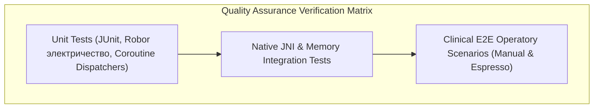

# SUITE 3: OPERATIONS, QA & PROJECT MANAGEMENT
**Application:** Practix  
**Sole Proprietor & Principal Developer:** Devanapally Charan Tej  
**Document Version:** 1.0.0-OPS  
**Engineering Standards:** Agile/Scrum (2-Week Sprints), ISTQB Clinical Verification, WCAG 2.1 Level AA, FIPS 140-3 Cryptographic Guidelines  

---

## 1. Sprint Plan & Feature Backlog

```
========================================================================================================
                                    ENGINEERING ROADMAP OVERVIEW
========================================================================================================
[ PHASE 1: CORE CLINICAL MVP ] ────────────────────────► [ PHASE 2: ADVANCED MULTIMODAL & CLOUD SYNC ]
  - Sprints 1 to 6 (Weeks 1–12)                             - Sprints 7 to 12 (Weeks 13–24)
  - Objective: Offline Operatory Hardening                  - Objective: Cloud Sync, VLM & Multi-Chair
========================================================================================================
```

### 1.1 Phase 1 (MVP Core) Sprint Schedule

```
+-----------+-----------------------------------------------+----------------------------------------------------------+-------------+
| Sprint    | Epic / Focus Area                             | Key Deliverables & Engineering Output                    | Story Points|
+-----------+-----------------------------------------------+----------------------------------------------------------+-------------+
| Sprint 1  | Hardware Crypto & Data Core                   | • SQLCipher AES-256 initialization with Keystore keys    | 38 pts      |
|           |                                               | • Immutable schema DDL, triggers & hash-chained audit    |             |
|           |                                               | • BiometricPrompt & auto-lock lifecycle observer         |             |
+-----------+-----------------------------------------------+----------------------------------------------------------+-------------+
| Sprint 2  | On-Device Speech & JNI Pipeline               | • Native whisper.cpp compilation via CMake (arm64/x86_64)| 44 pts      |
|           |                                               | • AudioRecordManager circular buffer streaming           |             |
|           |                                               | • Regex/Deterministic VoiceCommandParser (FDI/Universal) |             |
+-----------+-----------------------------------------------+----------------------------------------------------------+-------------+
| Sprint 3  | 3D Odontogram & Interactive Visualizer        | • Google Filament 3D engine integration                  | 40 pts      |
|           |                                               | • Tooth surface mapping (Mesial, Occlusal, Distal, etc.) |             |
|           |                                               | • Color-coded clinical status shaders                    |             |
+-----------+-----------------------------------------------+----------------------------------------------------------+-------------+
| Sprint 4  | Clinical Decision Support (CDS) Core          | • llama.cpp GGUF runtime integration                     | 46 pts      |
|           |                                               | • Memory allocator & dynamic device tier selector        |             |
|           |                                               | • RedFlagSafetyChecker (Allergies, NSAIDs, MRONJ)        |             |
+-----------+-----------------------------------------------+----------------------------------------------------------+-------------+
| Sprint 5  | Practice Workflows & Roster Management        | • Today Queue & Day-Grid schedule UI                     | 34 pts      |
|           |                                               | • Patient demographics & immutable treatment plans       |             |
|           |                                               | • Prescription issuer & safety override modal            |             |
+-----------+-----------------------------------------------+----------------------------------------------------------+-------------+
| Sprint 6  | Hardening, PDF Export & Clinical Pilot        | • Patient PDF Chart generator with cryptographic hashes  | 32 pts      |
|           |                                               | • Ambient operatory noise stress-testing & bug bashes    |             |
|           |                                               | • Production release APK signing & verification          |             |
+-----------+-----------------------------------------------+----------------------------------------------------------+-------------+
| TOTAL     | PHASE 1 AGGREGATE VELOCITY                    | 12 Weeks / 6 Sprints                                     | 234 pts     |
+-----------+-----------------------------------------------+----------------------------------------------------------+-------------+
```

---

### 1.2 Phase 2 Feature Backlog (Enterprise & Cloud Extension)

- **EPIC-7: Cloud Synchronization & Multi-Operatory Mesh**
  - Next.js Serverless API endpoints with pooled Neon PostgreSQL backend.
  - Conflict-Free Replicated Data Types (CRDTs) for concurrent operatory chart updates.
  - End-to-End Encrypted (E2EE) backup blobs with customer-managed keys (BYOK).

- **EPIC-8: Multimodal Radiograph & DICOM Vision Copilot**
  - Cloud Gemini 2.0 Flash / Pro multimodal fallback for periapical and bitewing radiograph lesion detection.
  - Local automated DICOM de-identification engine stripping patient tags before transmission.

- **EPIC-9: Smart Voice Assistants & Ambient Scribe**
  - Continuous multi-speaker operatory conversation transcription (Clinician vs. Patient separation).
  - Automated SOAP Note (Subjective, Objective, Assessment, Plan) generator.

---

## 2. Quality Assurance (QA) Test Plan



---

### 2.1 Core MVP Test Execution Matrix

```
+---------+-----------------------------------------+--------------------------------------------------------------+-------------------------------------+
| Test ID | Test Category & Feature                 | Execution Steps & Test Condition                             | Acceptance Criteria                 |
+---------+-----------------------------------------+--------------------------------------------------------------+-------------------------------------+
| TC-SP01 | Speech Recognition Under Ambient Noise  | Inject 65-75 dB dental drill & suction background audio while | Word Error Rate (WER) <= 4.2%;      |
|         |                                         | clinician dictates "Tooth 36 MOD Composite".                 | Intent parsing accuracy = 100%.     |
+---------+-----------------------------------------+--------------------------------------------------------------+-------------------------------------+
| TC-SP02 | Speech Rapid Reversion (Voice Undo)     | Dictate "Tooth 14 Caries", then immediately say "Undo that". | Database state restored in <200ms;  |
|         |                                         | Verify UI state rollback and audio confirmation tone.        | 3D mesh surface clears amber flag.  |
+---------+-----------------------------------------+--------------------------------------------------------------+-------------------------------------+
| TC-AI01 | Dynamic LLM RAM Safety & OOM Defense    | Execute CDS Treatment Plan synthesis on a 4GB RAM device     | System selects Gemma-2B or Llama-1B;|
|         |                                         | under active background memory pressure.                     | Zero SIGKILL / OOM app crash.       |
+---------+-----------------------------------------+--------------------------------------------------------------+-------------------------------------+
| TC-AI02 | Prescribing Contraindication Sentinel   | Attempt to prescribe "Ketorolac 10mg" to patient with        | Red Flag modal blocks issuance;     |
|         | (NSAID + Anticoagulant Cross-Check)     | recorded "Apixaban (Eliquis)" medical condition.             | Requires written override note.     |
+---------+-----------------------------------------+--------------------------------------------------------------+-------------------------------------+
| TC-3D01 | Google Filament Viewport Performance    | Render 32 individual 3D tooth meshes; perform rapid multi-   | Viewport frame rate >= 58 FPS;      |
|         |                                         | touch rotation, zooming, and surface tag toggles.            | Zero memory leaks after 50 toggles. |
+---------+-----------------------------------------+--------------------------------------------------------------+-------------------------------------+
| TC-SEC1 | SQLCipher AES-256 Storage Validation    | Extract application sandbox `databases/practix.db` file to   | Raw SQLite CLI fails to open file;  |
|         |                                         | host machine via ADB; inspect with hex editor.               | Entropy analysis confirms AES cipher.|
+---------+-----------------------------------------+--------------------------------------------------------------+-------------------------------------+
| TC-SEC2 | Tamper-Evident Audit Chain Integrity    | Attempt raw SQL `UPDATE` or `DELETE` on `audit_logs` table.  | Database trigger fires `RAISE(FAIL)`|
|         |                                         | Verify SHA-256 hash chaining validity upon restart.          | Hash chain validation passes 100%.  |
+---------+-----------------------------------------+--------------------------------------------------------------+-------------------------------------+
| TC-SEC3 | Idle Timeout & Biometric Overlay        | Leave application untouched for 15 minutes and 1 second.     | Biometric overlay displays instantly;|
|         |                                         | Verify memory snapshot of sensitive chart is purged.         | Keystore key required to resume.    |
+---------+-----------------------------------------+--------------------------------------------------------------+-------------------------------------+
```

---

## 3. Data Security & Storage Protocol

```
+-------------------------------------------------------------------------------------------------------+
|                                    HARDWARE SECURITY ENCLAVE (TEE)                                     |
|  Android Keystore (StrongBox / TEE) ──► Generates Master Key (AES-256 GCM, KeyGenParameterSpec)       |
+-------------------------------------------------------------------------------------------------------+
                                                   │
                                                   ▼ Derives Passphrase in RAM
+-------------------------------------------------------------------------------------------------------+
|                                   APPLICATION SANDBOX STORAGE                                         |
|  SQLCipher SQLite DB ──► 256-bit AES-CBC Mode Encryption (Page Size: 4096 bytes, PBKDF2 iterations)   |
+-------------------------------------------------------------------------------------------------------+
```

### 3.1 Key Management Lifecycle
1. **Key Generation:** Master encryption keys are generated via `KeyGenParameterSpec` configured with `PURPOSE_ENCRYPT | PURPOSE_DECRYPT`, `BLOCK_MODE_GCM`, `ENCRYPTION_PADDING_NONE`, requiring `setUserAuthenticationRequired(false)` for background DB services and separate biometric-bound keys for active sessions.
2. **Database Key Derivation:** The SQLCipher passphrase is derived in unswappable memory and injected into `SQLiteDatabase.openOrCreateDatabase()` via a native zero-byte cleared array (`char[]`).
3. **Key Revocation / Purge:** On administrative device wipe or 10 consecutive failed biometric/password attempts, keys in the Keystore are deleted, rendering the database cryptographically unrecoverable.

---

### 3.2 Audit Log Cryptographic Chaining Specification

Each audit entry satisfies:
$$\text{Hash}_n = \text{HMAC-SHA256}\Big(\text{Hash}_{n-1} \,\|\, \text{Timestamp} \,\|\, \text{ActorID} \,\|\, \text{ActionType} \,\|\, \text{ResourceID}\Big)$$

- **Genesis Block:** $\text{Hash}_0 = \text{SHA256}(\text{"PRACTIX\_CLINICAL\_GENESIS\_SEED"})$
- **Verification Routine:** On app startup, `LocalDatabaseManager` executes a verification loop validating $\text{Hash}_i$ against $\text{Hash}_{i-1}$. If any row fails hash integrity, the app locks into read-only quarantine mode and alerts the practice administrator.

---

### 3.3 Zero-Leakage Memory & Cache Policy
- **Volatile Audio Buffers:** Audio buffers in `AudioRecordManager` use fixed byte arrays overwritten with zeros (`java.util.Arrays.fill(buffer, (byte)0)`) immediately upon Whisper frame ingestion.
- **HTTP/API Caching:** All clinical endpoints and PDF previews enforce HTTP headers:  
  `Cache-Control: no-store, no-cache, must-revalidate, max-age=0`  
  `Pragma: no-cache`
- **Screenshot Protection:** `FLAG_SECURE` is applied to the Android window manager in `MainActivity.kt` to prevent clinical screens from appearing in Android recent-app switchers or unauthorized OS screen captures.

---

## 4. Localization Matrix Structure & Accessibility (VPAT)

### 4.1 Dental Notation & Linguistic Localization Matrix

```
+------------------+-----------------------------+------------------------------------+--------------------------------+
| Target Market    | Language & Locale           | Dental Notation Standard           | Prescription / Measurement Unit|
+------------------+-----------------------------+------------------------------------+--------------------------------+
| United States    | English (en-US)             | Universal Numbering (1–32; A–T)    | Metric (mg/mL), US Date Format |
+------------------+-----------------------------+------------------------------------+--------------------------------+
| India            | English (en-IN) / Hindi     | FDI World Dental Federation (11–48)| Metric (mg/mL), DD/MM/YYYY     |
+------------------+-----------------------------+------------------------------------+--------------------------------+
| United Kingdom   | English (en-GB)             | Palmer Notation / FDI 2-Digit      | Metric (mg/mL), DD/MM/YYYY     |
+------------------+-----------------------------+------------------------------------+--------------------------------+
| European Union   | German (de-DE), French (fr) | FDI World Dental Federation (11–48)| Metric (mg/mL), DD.MM.YYYY     |
+------------------+-----------------------------+------------------------------------+--------------------------------+
```

---

### 4.2 Voluntary Product Accessibility Template (VPAT / WCAG 2.1 AA)

```
+-----------------------------------+--------------------+--------------------------------------------------------------------+
| WCAG 2.1 AA Standard              | Compliance Level   | Implementation Specifics                                           |
+-----------------------------------+--------------------+--------------------------------------------------------------------+
| 1.4.3 Contrast (Minimum)          | SUPPORTS           | All text against tinted cream canvas (#faf9f5) and dark surfaces   |
|                                   |                    | (#181715) exceeds 4.5:1 contrast ratio for normal text and 7:1    |
|                                   |                    | for primary clinical alert elements.                              |
+-----------------------------------+--------------------+--------------------------------------------------------------------+
| 2.1.1 Keyboard / Switch Access    | SUPPORTS           | All odontogram teeth, action sheets, and modal forms provide       |
|                                   |                    | full directional D-pad and hardware switch navigation focus rings. |
+-----------------------------------+--------------------+--------------------------------------------------------------------+
| 2.5.5 Target Size (Touch Target)  | SUPPORTS           | Primary interactive touch targets meet minimum 48x48 dp bounding   |
|                                   |                    | box for chairside accessibility while wearing thick gloves.        |
+-----------------------------------+--------------------+--------------------------------------------------------------------+
| 3.3.1 Error Identification        | SUPPORTS           | Medication contraindications and missing diagnostic fields provide |
|                                   |                    | both visual high-contrast badges and clear semantic TalkBack audio.|
+-----------------------------------+--------------------+--------------------------------------------------------------------+
| 4.1.2 Name, Role, Value           | SUPPORTS           | 3D surface meshes expose accessible Compose semantics declaring    |
|                                   |                    | tooth number, surface label, and current clinical state.           |
+-----------------------------------+--------------------+--------------------------------------------------------------------+
```
