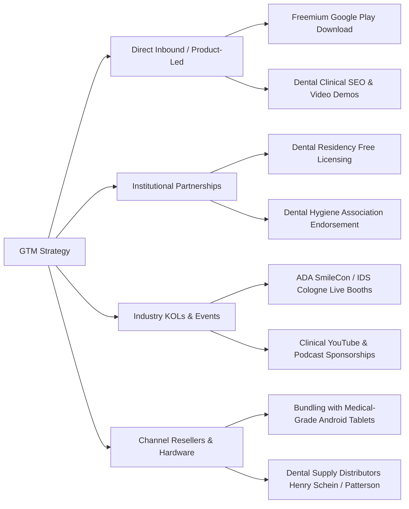

# SUITE 4: BUSINESS & INTELLECTUAL PROPERTY
**Application:** Practix  
**Sole Proprietor & Principal Developer:** Devanapally Charan Tej  
**Document Version:** 1.0.0-BIZ-IP  
**Target Market:** Global Dental Practice Management, Dental Service Organizations (DSOs), Independent Practitioners  

---

## 1. Go-To-Market (GTM) Strategy & Acquisition Channels

```
========================================================================================================
                               COMMERCIALIZATION FUNNEL & GROWTH FLYWHEEL
========================================================================================================
[ PRODUCT-LED ADOPTION ] ────────► [ DSO & ENTERPRISE CONVERSION ] ────────► [ REVENUE EXPANSION ]
  - Free Student / Solo Tier          - Multi-chair Clinic Subscriptions         - Multimodal AI Add-ons
  - High Chairside Utility            - Practice Analytics & Cloud Sync          - API Clearinghouse Integrations
========================================================================================================
```

### 1.1 Target Customer Segmentation & ICP (Ideal Customer Profile)

```
+--------------------------+-------------------------------------+------------------------------------------------------------+
| Segment                  | Profile & Practice Size             | Primary Value Driver & Purchase Motivation                 |
+--------------------------+-------------------------------------+------------------------------------------------------------+
| Solo Private Dentist     | 1–2 Operatories, General Dentistry  | Eliminates chairside charting delays; zero IT / server     |
|                          | ($400k–$800k annual collections)    | setup overhead; runs 100% locally on Android tablets.      |
+--------------------------+-------------------------------------+------------------------------------------------------------+
| Group Practices & DSOs   | 5–50+ Operatories, Multi-specialty  | Standardized documentation compliance, reduced cross-      |
| (Dental Service Orgs)    | ($2M–$25M annual collections)       | contamination risks, tamper-evident audit logging.         |
+--------------------------+-------------------------------------+------------------------------------------------------------+
| Academic & Dental Inst.  | Universities, Dental Hygiene Schools| Educational 3D odontogram visualization, structured CDS,   |
|                          | & Residency Programs                | dual-numbering system training (FDI / Universal).          |
+--------------------------+-------------------------------------+------------------------------------------------------------+
```

---

### 1.2 Multi-Tier B2B SaaS Monetization Model

```
+-----------------------+-----------------------------+------------------------------------+----------------------------------+
| Feature / Capability  | Free Tier (Solo / Student)  | Pro Practice Tier ($89/chair/mo)   | DSO Enterprise ($149/chair/mo)   |
+-----------------------+-----------------------------+------------------------------------+----------------------------------+
| Offline Voice Engine  | Included (Standard Whisper) | Included (High-Precision Whisper)  | Included (Custom Operatory Tuning|
| 3D Odontogram Engine  | Standard Quadrant View      | Full Anatomical Mesh + Color Codes | Full Custom 3D Mesh & Branding   |
| Local CDS & Red Flags | Basic Allergy Checks        | Full Multi-Agent Llama/Gemma Engine| Custom DSO Clinical Rule Engine  |
| Active Patients Limit | Up to 100 Patients          | Unlimited                          | Unlimited                        |
| Cloud Sync & Backup   | Manual Local Export Only    | Multi-Device Real-Time Sync        | E2EE Private Cloud / On-Prem     |
| Audit & Security      | Standard SQLite Security    | SQLCipher + Biometric Lockout      | Full SIEM / SOC 2 Audit Export   |
| Support SLA           | Community / Self-Serve      | 24/5 Email & In-App Support        | 24/7 Dedicated Account Rep + BAA |
+-----------------------+-----------------------------+------------------------------------+----------------------------------+
```

---

### 1.3 Key Acquisition & Distribution Channels



---

### 1.4 Financial Unit Economics (Target Metrics)

```
+------------------------------------+------------------------------------+-------------------------------------------+
| Metric                             | Target (Year 1)                    | Target (Year 3)                           |
+------------------------------------+------------------------------------+-------------------------------------------+
| Customer Acquisition Cost (CAC)    | $340 per practicing clinician      | $195 per clinician (viral referral loops) |
| Customer Lifetime Value (LTV)      | $3,200 (based on 36-month average) | $5,800 (via DSO expansion & AI add-ons)   |
| LTV : CAC Ratio                    | 9.4 : 1                            | 29.7 : 1                                  |
| Monthly Net Revenue Churn          | < 0.8%                             | < 0.3%                                    |
| Gross Margin                       | 88% (due to on-device computing)   | 92% (optimized serverless sync)           |
+------------------------------------+------------------------------------+-------------------------------------------+
```

---

## 2. Standard Contractor NDA & Intellectual Property Assignment Agreement

**IMPORTANT LEGAL NOTICE:** *This template is drafted for technology contractors, engineers, and clinical advisors participating in the development of Practix. Consult qualified legal counsel before formal execution.*

---

### CONFIDENTIALITY, PROPRIETARY INFORMATION, AND INVENTIONS ASSIGNMENT AGREEMENT

This Agreement is entered into as of this _____ day of ______________, 202___, by and between **Devanapally Charan Tej**, trading as **Practix** (the "Proprietor"), and ___________________________________ ("Contractor").

#### 1. Confidential Information & Trade Secrets
1.1 **Definition:** "Confidential Information" means any and all proprietary, technical, operational, and clinical information disclosed by the Proprietor to Contractor, including but not limited to:
- Source code, algorithms, build scripts, and architecture for native C++ bridges (`libpractix_native.so`, `whisper.cpp`, `llama.cpp` implementations).
- Quantized machine learning model weights, prompts, fine-tuning corpora, and clinical decision support rule sets.
- 3D rendering pipeline code, custom shaders, and 3D dental tooth mesh assets (`mandibular-first-molar.obj`).
- Internal business metrics, GTM strategies, clinician customer rosters, and pricing models.

1.2 **Exclusions:** Confidential Information does not include information that: (a) is or becomes publicly known through no breach of this Agreement; (b) was already in Contractor's lawful possession prior to disclosure without confidentiality restrictions; or (c) is independently developed by Contractor without reference to Proprietor Confidential Information.

1.3 **Non-Disclosure & Standard of Care:** Contractor shall hold all Confidential Information in strict confidence and shall not disclose, reproduce, or distribute it to any third party without express prior written consent. Contractor agrees to apply the same degree of care (and not less than a reasonable degree of care) that it applies to its own highly confidential proprietary data.

---

#### 2. Ownership & Intellectual Property (IP) Assignment

2.1 **Work Made for Hire:** Contractor acknowledges and agrees that all original works of authorship, designs, models, software, algorithms, databases, clinical workflows, and inventions created, authored, or developed by Contractor (solely or jointly with others) within the scope of Contractor's engagement with the Proprietor (collectively, "Work Product") shall be deemed a **"Work Made for Hire"** to the fullest extent permitted by law.

2.2 **Comprehensive Assignment:** In the event any Work Product does not qualify as a Work Made for Hire, Contractor hereby unconditionally and irrevocably assigns, transfers, and conveys to Devanapally Charan Tej all right, title, and interest worldwide in and to such Work Product, including all associated:
- Patent rights, patent applications, and provisional filings.
- Copyrights, moral rights, and mask works.
- Trade secrets, proprietary weights, algorithms, and know-how.
- Trademark rights, domain names, and trade dress.

2.3 **Power of Attorney:** If the Proprietor is unable, after reasonable effort, to secure Contractor's signature on any document needed to apply for, register, or enforce any patent, copyright, or other right assigned hereunder, Contractor hereby irrevocably designates and appoints Devanapally Charan Tej as Contractor’s agent and attorney-in-fact to act for and on Contractor’s behalf to execute and file any such applications and legal instruments.

---

#### 3. Protection of AI Model Weights & Clinical Datasets
Contractor expressly agrees that:
- Any quantized model configurations (GGUF), LoRA weights, fine-tuning checkpoints, or prompt engineering assets developed during the contract term are the exclusive property of Devanapally Charan Tej (Practix).
- Contractor shall not extract, export, or train external AI models (including public Foundation models or competing commercial tools) using Practix's proprietary clinical corpora, voice dictation recordings, or dental datasets.

---

#### 4. Non-Solicitation & Non-Competition Covenants
4.1 **Non-Solicitation:** During the term of engagement and for a period of twelve (12) months following termination, Contractor shall not directly or indirectly solicit, induce, or attempt to hire any employee, contractor, or clinical advisor of Practix.
4.2 **Non-Competition:** Contractor shall not develop, market, or advise a directly competing standalone on-device voice-driven dental charting application utilizing native on-device speech/LLM engines for a period of twelve (12) months following the termination of this Agreement.

---

#### 5. Return of Materials & Cryptographic Purge
Upon termination of engagement or upon written request by the Proprietor, Contractor shall immediately:
- Return all physical assets, developmental devices, and hardware keys.
- Irrevocably delete and cryptographically overwrite all copies of source code, model weights, local SQLite/SQLCipher databases, and technical documentation from Contractor’s personal computers, cloud drives, and development environments.
- Provide a signed written certification confirming complete compliance with this section within five (5) business days.

---

#### 6. Governing Law & Jurisdiction
This Agreement shall be governed by, construed, and enforced in accordance with the applicable laws of India (or applicable national jurisdiction agreed upon in the statement of work), without regard to conflict of laws principles. Any legal action or proceeding arising under this Agreement shall be brought exclusively in the courts of competent jurisdiction located in that forum.

---

### SIGNATURES AND ACKNOWLEDGMENT

**PRACTIX**

By: _________________________________________  
Name: Devanapally Charan Tej  
Title: Sole Proprietor & Principal Developer  
Date: _______________________________________  

**CONTRACTOR / DEVELOPER**

By: _________________________________________  
Name: _______________________________________  
Title / Role: _________________________________  
Date: _______________________________________  
